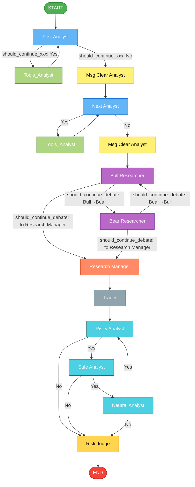

```mermaid
flowchart TD
    %% Start
    START([START]):::start --> A1[First Analyst]:::analyst

    %% Analyst Loop
    A1 -->|should_continue_xxx: Yes| T1[Tools_Analyst]:::tool --> A1
    A1 -->|should_continue_xxx: No| C1[Msg Clear Analyst]:::clear

    %% Analyst chain
    C1 --> A2[Next Analyst]:::analyst
    A2 -->|Yes| T2[Tools_Analyst]:::tool --> A2
    A2 -->|No| C2[Msg Clear Analyst]:::clear

    %% Last Analyst to Bull Researcher
    C2 --> Bull[Bull Researcher]:::research

    %% Debate loop
    Bull -->|should_continue_debate: Bull→Bear| Bear[Bear Researcher]:::research
    Bear -->|should_continue_debate: Bear→Bull| Bull
    Bull -->|should_continue_debate: to Research Manager| RM[Research Manager]:::manager
    Bear -->|should_continue_debate: to Research Manager| RM

    %% Trader and Risk Cycle
    RM --> Trader[Trader]:::trader
    Trader --> Risky[Risky Analyst]:::risk

    Risky -->|Yes| Safe[Safe Analyst]:::risk
    Risky -->|No| RJ[Risk Judge]:::judge

    Safe -->|Yes| Neutral[Neutral Analyst]:::risk
    Safe -->|No| RJ

    Neutral -->|Yes| Risky
    Neutral -->|No| RJ

    %% End
    RJ --> END([END]):::endNode

    %% Styles
    classDef start fill:#4CAF50,stroke:#2E7D32,color:#fff;
    classDef endNode fill:#F44336,stroke:#B71C1C,color:#fff;
    classDef analyst fill:#64B5F6,stroke:#1976D2,color:#fff;
    classDef tool fill:#AED581,stroke:#558B2F,color:#fff;
    classDef clear fill:#FFF176,stroke:#FBC02D,color:#000;
    classDef research fill:#BA68C8,stroke:#6A1B9A,color:#fff;
    classDef manager fill:#FF8A65,stroke:#D84315,color:#fff;
    classDef trader fill:#90A4AE,stroke:#455A64,color:#fff;
    classDef risk fill:#4DD0E1,stroke:#006064,color:#fff;
    classDef judge fill:#FFD54F,stroke:#FF6F00,color:#000;
```